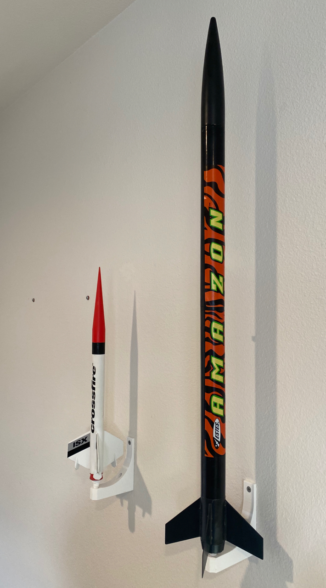

# Model Rocket Wall Mount

## Summary

Model rockets are fragile and storing them safely is challenging.
Making them visually-accessible via display helps to keep interest and curiosity in rocketry.

This project provides the 3D models for a bracket allowing storage and display of model rockets.
Since model rockets can take several newtons of force through their engine mounts - it is assumed that this is the most durable part of the rocket to use for mounting.
The wall bracket mounts the rocket vertically on the wall by way of an engine-blank.

Included parts for mounting:
1. Wall bracket
1. Engine blank

Required parts to complete:
1. 2x small drywall screws (or similar) for each bracket

## Print Settings

Print the engine blank in draft mode, as it's asthetics are not required to hold the rockets, and the thicker extrusion will make the part somewhat stronger and faster printing.
Print the wall braket, laying on it's side, with 0.15 to 0.20 mm layer height for asthetic reasons, ~15% infill.

Use PLA or PETG. Note that PLA may give better performance with overhangs, obviating the need for supports. PETG does require supports.

Rockets weighing more than 2 lbs may need different settings.

## Post-Printing Installation

Install on the wall using simple drywall screws. I used 1.25" silver screws. Don't over-tighten them - they should just be barley "firm".
Consider spacing the brackets 6 inches or more apart on the wall to prevent neighboring rocket fins from touching.

## How I Designed This

OpenSCAD and a pair of calipers for measuring the fleet of rockets.
